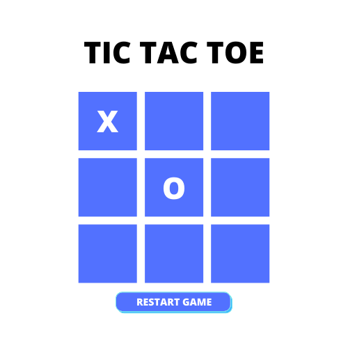

# tic-tac-toe

## What is it?
A simple, two player tic tac toe (or naughts and crosses) game!

## ▶️ Wanna play?
- See the live game [here](https://kaytawho.github.io/tic-tac-toe/)

## 👩🏾‍💻 Tech Used

-   HTML
-   CSS
-   JavaScript

## ✍🏾 Approach
- Researched tic tac toe games
- Created pseudocode
- Created mockup
- Created basic JavaScript, HTML and CSS
- Kept iterating

## 💡 Pseudocode

- **Rendering the game in the browser**
    - Display player 1 - X
    - Display player 2 - O
    - Display a 3 x 3, clickable grid
    - 3 x 3 grid should display the player's selection (X or O)
    - The game displays whose turn it is
    - The game shows won the game
    - The game shows if its a draw
    - The game can be restarted using a restart button
    
- **Switching turns between players**
    - Upon click, update the grid to display the player's selection (X or O)
    - game checks if a valid move has been made
        - if valid move - update cell
        - if invalid - do nothing
    - game updates
    
- **Logic for winning & visually display which player won**
    - check if a player has won
        - if player X has three Xs in a row - player X has won
        - if player O has three Os in a row - player O has won
    - if a player has won, display the winner message and end game
    - if both players are a draw, display the draw message and end game
    - if a player has not won, wait for the next click to update grid and repeat

## 🖥️ Mockup

## 🎮 Features
- Reset game functionality
- Scoreboard with score reset functionality
- How to instructions for players
- Basic mobile responsiveness

## 👾 Future Features
- Player vs. Bot
- Sound effects
- On-page transitions/animations
